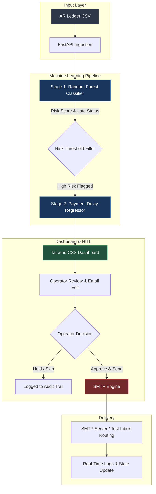

# AutoCollect AI — Human-in-the-Loop Dunning & AR Risk Engine

AutoCollect AI connects machine learning credit risk models directly to daily accounts receivable (AR) follow-ups. Instead of blasting clients with generic automated emails that get ignored, AutoCollect uses a 2-stage ML model to catch high-risk invoices and pre-fill personalized email drafts so a human can review and send them in one click.

---

## Architecture Flow

What It Does
Flags Risky Invoices: Uses a Stage 1 Random Forest classifier (93% accuracy) to filter out accounts likely to pay late.

Estimates Delays: Runs a Stage 2 regression model to estimate how many days payment will be delayed so you can prioritize who to contact first.

Drafts Custom Follow-Ups: Automatically writes a clear email referencing the exact invoice number, amount due, and payment terms.

Human-in-the-Loop Control: Gives finance teams a simple dashboard to double-check risk scores, tweak email text, and hit send.

Live SMTP Delivery: Connects to an active SMTP server to send emails in real time (routed to a test inbox when working with public datasets without real contact details).

Tech Stack
Backend: Python, FastAPI, Uvicorn

ML & Data: Scikit-learn, Pandas, NumPy

Frontend: HTML5, Tailwind CSS, JavaScript

Tooling: uv, Python Email MIME, SMTP

Repository Structure
Plaintext
autocollect-ai-dunning-engine/
├── data/
│   └── WA_Fn-UseC_-Accounts-Receivable.csv   # Dataset used for training and testing
├── models/
│   ├── stage_1_classifier.pkl                # Risk prediction model
│   └── stage_2_regressor.pkl                 # Payment delay estimator
├── notebooks/
│   ├── exploratory_analysis.ipynb            # Data analysis and model building
│   └── agent.ipynb                           # Prompt and email testing
├── static/
│   └── index.html                            # Dashboard UI
├── main.py                                   # FastAPI backend app
├── pyproject.toml                            # Dependencies
├── uv.lock                                   # Lockfile
└── README.md                                 # Documentation
How to Run It Locally
1. Requirements
Make sure you have Python 3.10+ installed. Using uv is recommended for fast setup.

2. Setup
Clone the repository and install dependencies:

Bash
git clone https://github.com/sajesh-nair/autocollect-ai-dunning-engine.git
cd autocollect-ai-dunning-engine

# If using uv
uv sync

# Or using pip
pip install -r requirements.txt
3. Start the Server
Run the FastAPI backend:

Bash
uvicorn main:app --reload
Open your browser and head to [http://127.0.0.1:8000](http://127.0.0.1:8000) to see the dashboard in action.

Push Commands:
Bash
git add README.md
git commit -m "docs: update readme with human written text and architecture"
git push
