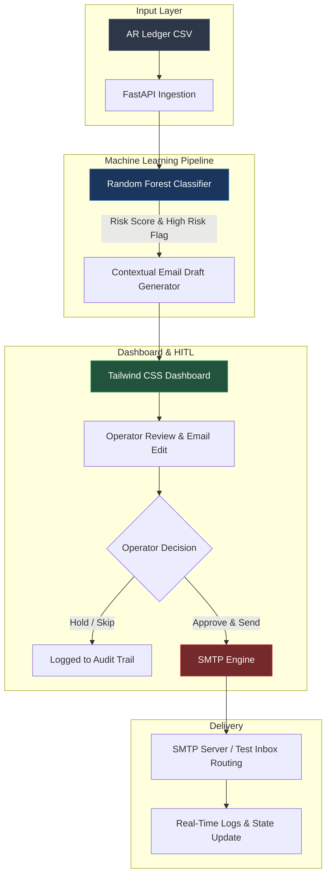

# AutoCollect AI — Human-in-the-Loop Dunning & AR Risk Engine

[](https://github.com/sajesh-nair/autocollect-ai-dunning-engine#high-level-system-architecture)

AutoCollect AI connects machine learning credit risk models directly to daily accounts receivable (AR) follow-ups. Instead of blasting clients with generic automated emails that get ignored, AutoCollect uses a Random Forest classifier to flag high-risk invoices and pre-fill context-aware email drafts for one-click human review and dispatch.


## High-Level System Architecture


## Detailed Architecture Flow



---

## Core Capabilities

* **ML Risk Scoring:** Evaluates historical payment behavior using a Random Forest classifier to identify accounts with high probabilities of delay (93% accuracy).
* **Context-Aware Email Generation:** Dynamically drafts tailored dunning notices referencing specific invoice numbers, outstanding balances, and payment terms.
* **Human-in-the-Loop Governance:** Provides finance teams with a clean interface to inspect model predictions, edit draft text, and manually trigger dispatches.
* **SMTP Integration:** Handles real-time email delivery via standard SMTP protocols, configured with fallback test routing for non-production environments.

---

## Tech Stack

* **Backend:** Python 3.10+, FastAPI, Uvicorn
* **ML & Data:** Scikit-learn, Pandas, NumPy
* **Frontend:** HTML5, Tailwind CSS, JavaScript
* **Tooling:** `uv`, Python Email MIME, SMTP

---

## Repository Structure

```text
autocollect-ai-dunning-engine/
├── data/
│   └── WA_Fn-UseC_-Accounts-Receivable.csv   # Training and evaluation ledger data
├── models/
│   └── stage_1_classifier.pkl                # Serialized Random Forest risk classifier
├── notebooks/
│   ├── exploratory_analysis.ipynb            # Feature engineering & model evaluation
│   └── agent.ipynb                           # Prompt and email generation tests
├── static/
│   └── index.html                            # Operator dashboard UI
├── main.py                                   # FastAPI server & application logic
├── pyproject.toml                            # Dependency configuration
├── uv.lock                                   # Lockfile
└── README.md                                 # Documentation
```

Setup & Local Execution
Prerequisites
Python 3.10 or higher
Recommended package manager: uv

1. Installation
Bash
git clone [https://github.com/sajesh-nair/autocollect-ai-dunning-engine.git](https://github.com/sajesh-nair/autocollect-ai-dunning-engine.git)
cd autocollect-ai-dunning-engine

# Using uv (Recommended)
uv sync

# Or using pip
pip install -r requirements.txt
2. Run Application
Bash
uvicorn main:app --reload
Once running, navigate to http://127.0.0.1:8000 in your browser to access the dashboard.
